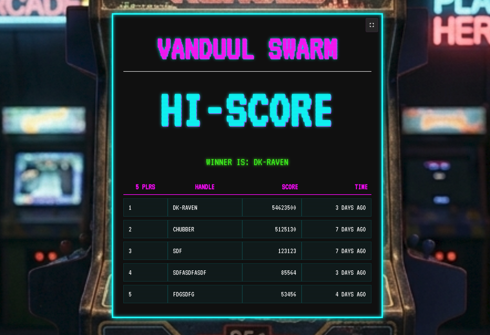
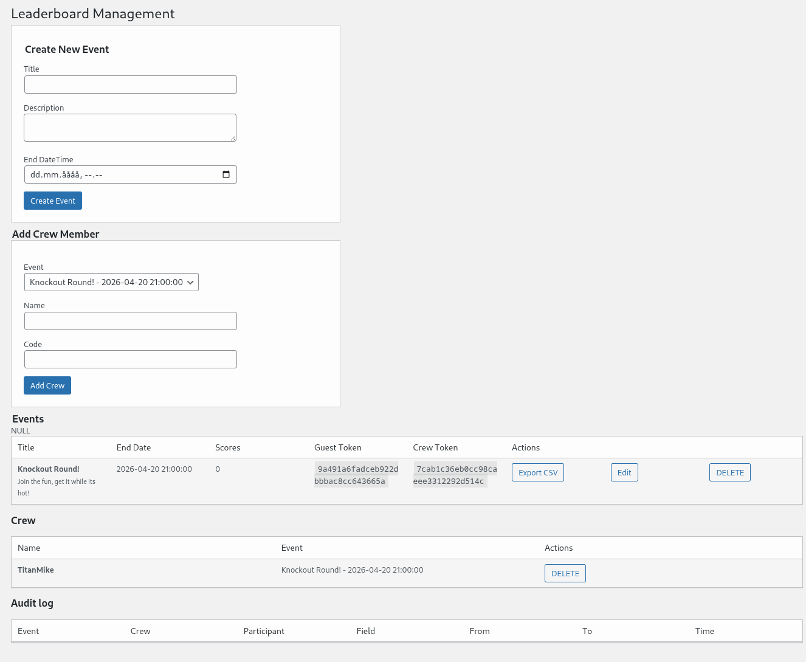
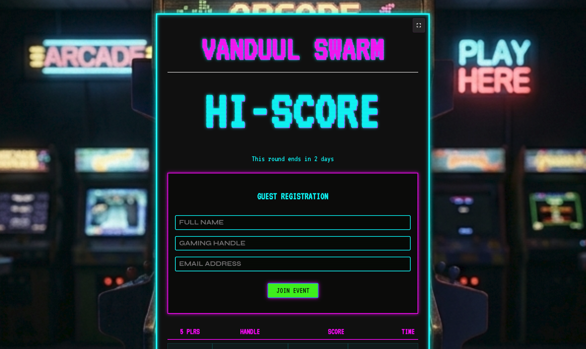
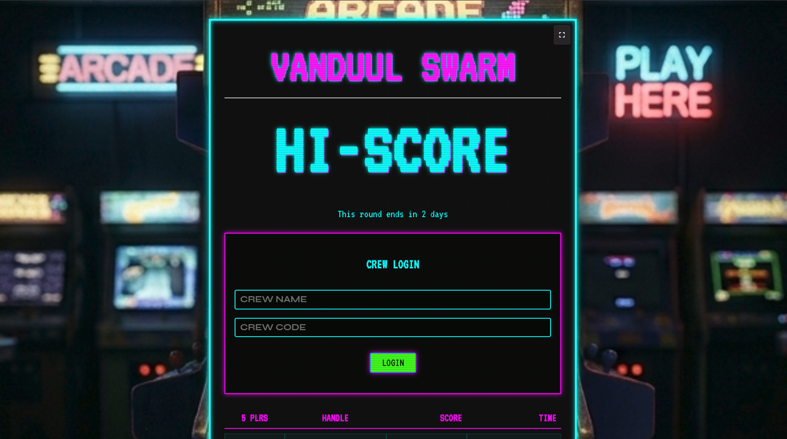
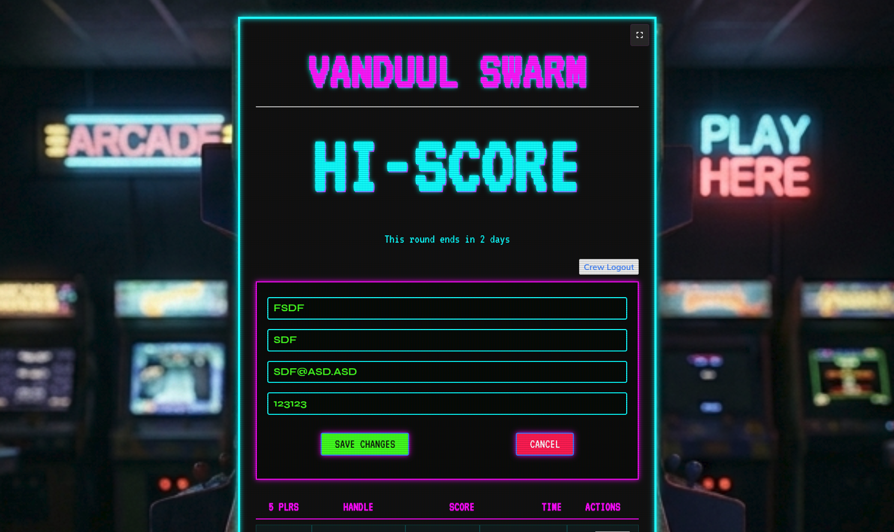
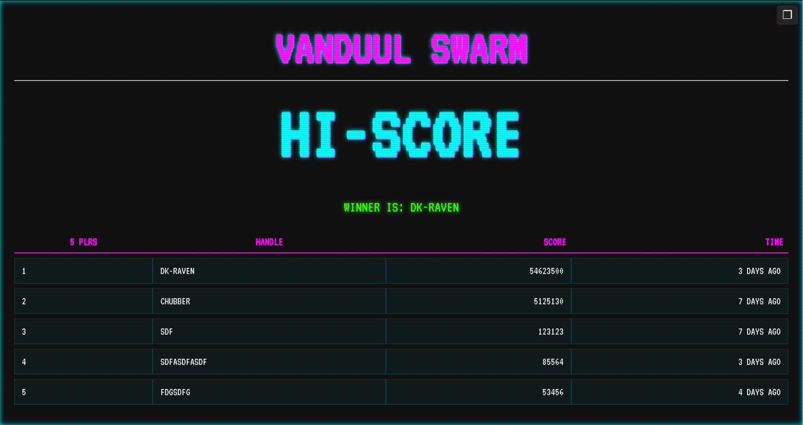
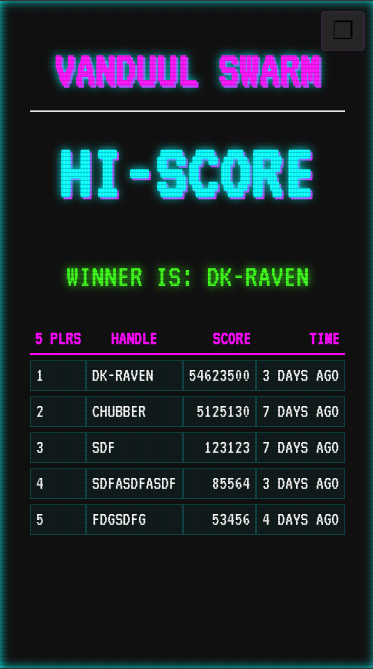

# Leaderboard for Gaming Events

A retro-inspired WordPress plugin for displaying and managing live scoreboards at gaming events, tournaments, speedrun meets, and LAN parties.

It combines a **classic arcade / CRT aesthetic** with practical event tools, so your leaderboard feels like an authentic old-school tournament display while still working smoothly on modern WordPress sites.

---

## Table of contents

- [Overview](#overview)
- [Features](#features)
- [Retro feel](#retro-feel)
- [Screenshots](#screenshots)
- [Installation](#installation)
- [Quick start](#quick-start)
- [How it works](#how-it-works)
- [Shortcode](#shortcode)
- [Frequently asked questions](#frequently-asked-questions)
- [Requirements](#requirements)
- [License](#license)
- [Author](#author)

---

## Overview

**Leaderboard for Gaming Events** helps you run a live scoreboard for gaming competitions and community events.

It is designed for:
- retro game nights
- local tournaments
- speedrunning events
- score challenges
- LAN parties
- convention competitions

The plugin provides:
- a **public-facing leaderboard**
- **guest registration**
- **crew login**
- **live score updates**
- **event management from WordPress admin**
- **CSV export**
- an **audit log** for changes

---

## Features

### For organizers
- Create and manage leaderboard events
- Set event title, description, and end date/time
- Add crew members for score entry
- Export results as CSV
- Review an audit log of changes

### For participants
- Register through guest mode
- Submit name, handle, and email
- Wait for scores to be entered by crew

### For staff
- Log in through crew mode
- Edit participant data
- Update scores
- See changes reflected live on the leaderboard

### For displays
- Automatic score refresh
- Full-screen / presentation-friendly mode
- Clean, high-contrast scoreboard layout
- Optimized for monitors, TVs, and projectors

---

## Retro feel

This plugin is intentionally styled to look like it belongs in a **1990s arcade tournament** or on a **CRT monitor in a gaming venue**.

### Visual style
- bright neon cyan and magenta accents
- dark background with glowing borders
- scanline-inspired overlay
- pixel-style typography
- bold uppercase headings
- flashy success/error messaging

### Design goal
The idea is not just to show scores, but to make the leaderboard itself part of the event atmosphere.

It should feel:
- energetic
- nostalgic
- dramatic
- arcade-like
- perfect for a big public display

If you want a scoreboard that looks more like a **tournament cabinet** than a plain web page, this plugin is built for that.

---

## Screenshots

Examples:
- Event management screen
  

- Guest registration view
  

- Crew login view
  

- Crew edit view
  

- Live scoreboard fullscreen
  

- Mobile friendly

  

---

## Installation

### Option 1: Install from ZIP
1. Download the plugin ZIP file
2. In WordPress admin, go to **Plugins → Add New → Upload Plugin**
3. Upload the ZIP
4. Activate the plugin

### Option 2: Manual installation
1. Upload the plugin folder to:

```plain text
wp-content/plugins/
```


2. Activate it from the **Plugins** screen in WordPress

---

## Quick start

1. Activate the plugin
2. Go to the **Leaderboard** menu in the WordPress admin
3. Create a new event
4. Share the appropriate access tokens with staff or participants
5. Add the leaderboard to a page using the shortcode
6. Open that page on a screen for live display

---

## How it works

The plugin uses a simple event workflow:

1. **Create an event** in the WordPress admin
2. **Share guest access** if participants need to register
3. **Share crew access** with staff who will manage scores
4. **Embed the leaderboard** on a page with the shortcode
5. **Display it live** on a monitor or projector

### Guest mode
Guest mode is for participants. They can enter:
- their name
- their gaming handle
- their email address

### Crew mode
Crew mode is for staff. They can:
- log in with crew credentials
- edit participant information
- enter or update scores
- see changes reflected in real time

---

## Shortcode

Use the shortcode on any WordPress page or post:

```plain text
[leaderboard event="Your Event Name"]
```


Replace `Your Event Name` with the exact title of the event you created in the admin panel.

### Optional display controls
If you want the leaderboard to take over the screen, place it on a dedicated page and open it in full-screen mode.

---

## Frequently asked questions

### Can I use this for a live event display?
Yes. It is designed specifically for live event presentation, especially on large displays.

### Does it refresh automatically?
Yes. The leaderboard updates live without requiring manual page reloads.

### Can I export results?
Yes. You can export event scores as CSV for spreadsheets, backups, or post-event reporting.

### Does it support translations?
Yes. The plugin is translation-ready.

### Is it good for retro-themed events?
Absolutely. The styling is intentionally built around an arcade and CRT-inspired look.

---

## Requirements

- WordPress
- PHP
- A browser for the live leaderboard display

---

## Development notes

If you're planning to contribute or customize:
- keep the retro visual identity intact
- test on both desktop and large display setups
- check the leaderboard in narrow and wide layouts
- verify guest and crew flows during a test event

---

## License

GPLv3

---

## Author

**Ulrich Dahl**

GitHub: [ulrichdahl](https://github.com/ulrichdahl/)

---

If you'd like, I can also make this into a **more “GitHub-ready” README** with:
- badges
- a cleaner project intro
- installation notes for releases
- a contribution section
- a changelog section
- screenshot captions and placeholders